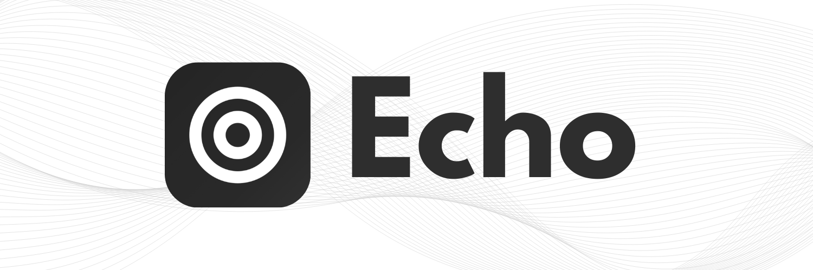
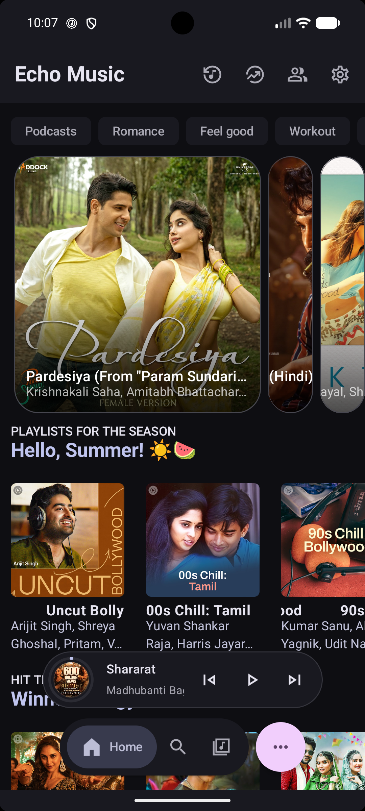
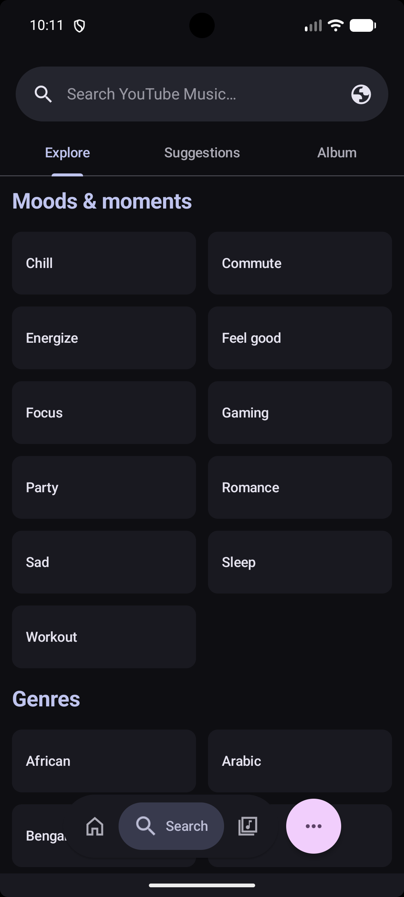
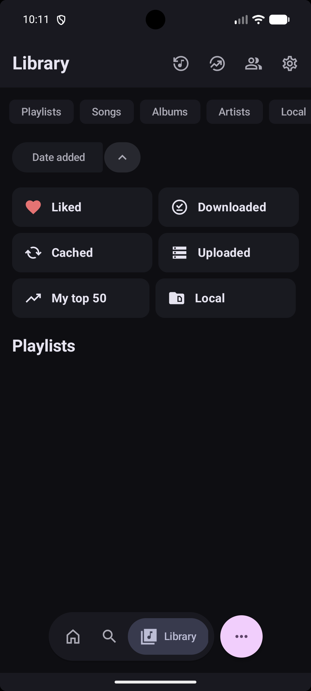

<div align="center">
  

  <h1>Echo Music</h1>

  <p><strong>A robust, open-source music streaming client offering an ad-free experience, offline capabilities, and advanced music discovery.</strong></p>

  <a href="https://trendshift.io/repositories/15844" target="_blank">
    
  </a>

<br>

  <a href="https://echomusic.fun/download">
    
  </a>
  &nbsp;
  <a href="https://echomusic.fun/obtainium">
    
  </a>
</div>

---

## Overview

Echo Music delivers a seamless, premium listening experience by leveraging YouTube Music's vast library — without the ads. It adds powerful extras including offline downloads, real-time synchronized lyrics, and environment-aware music recognition.

---

## Screenshots

<div align="center">
  
  
  
  
  
</div>

---

## Features

### What's New
- **Completely redesigned UI** — Cleaner and faster experience from the ground up.
- **Import from Spotify** — Bring your playlists and tracks over with ease.
- **Podcast support** — Listen to podcasts alongside your music library.
- **Local media support** — Play music stored directly on your device.
- **Auto data migration** — Seamlessly move existing app data to the new version.
- **Android Dynamic Island support** — Enhanced playback notifications on supported devices.

### Streaming & Playback
- **Ad-Free** — Stream without interruptions.
- **Seamless Playback** — Switch effortlessly between audio-only and video modes.
- **Background Playback** — Listen while using other apps or with the screen off.
- **Offline Mode** — Download tracks, albums, and playlists via a dedicated download manager.
- **Crossfade** — Smooth transitions between tracks.
- **Canvas Animations** — Visual animations while playing music.
- **Vertical Ambient Mode** — Immersive ambient visuals during playback.

### Discovery & Echo Find
- **Echo Find** — Identify songs playing around you using advanced audio recognition.
- **Smart Recommendations** — Personalized suggestions based on your listening history.
- **Comprehensive Browsing** — Explore Charts, Podcasts, Moods, and Genres.

### Lyrics
- **Multiple lyrics animations** — Choose from various lyric display styles.
- **Word-by-word lyrics** — Precise per-word synchronization.
- **Lyrics+** — New lyrics provider for improved accuracy and coverage.
- **AI lyrics translation** — Built-in Google Translate integration for any language.

### Integrations
- **Discord integration** — Show what you're listening to on Discord.
- **Last.fm integration** — Scrobble your plays automatically.
- **Music sharing via Odesli** — Share songs as Song.link for cross-platform listening.
- **Set as ringtone** — Directly set any song as your device ringtone.

### Smart Playback
- **Pause on mute** — Auto-pause when your device is muted.
- **Resume on Bluetooth connect** — Playback resumes when buds or headphones reconnect.
- **Keep screen on** — Prevent screen sleep while music is playing.
- **TTS song announcements** — Hear the song title and artist read aloud on track change.
- **Music haptics** — Tactile vibration feedback synced to the beat.

### Customization
- **UI density scale** — Adjust interface spacing to your preference.
- **High refresh rate support** — Smoother UI and animations on supported displays.
- **Hide player thumbnail** — Keep the player minimal without album art.
- **Crop album art** — Adjust album art display to fit your style.
- **Hide video songs** — Filter out video content from your feed.
- **Hide YouTube Shorts** — Keep Shorts out of your music browsing.

---

## Installation

### Android
Download the latest APK from the [Releases Page](https://github.com/iad1tya/Echo-Music/releases/latest).

### Build from Source

1. **Clone the repository**
   ```bash
   git clone https://github.com/iad1tya/Echo-Music.git
   cd Echo-Music
   ```

2. **Configure Android SDK**
   ```bash
   echo "sdk.dir=/path/to/your/android/sdk" > local.properties
   ```

3. **Firebase configuration**
   Firebase is required for analytics and reliable imports. See [FIREBASE_SETUP.md](FIREBASE_SETUP.md) for instructions on adding your `google-services.json`.

4. **Build**
   ```bash
   ./gradlew assembleFossDebug
   ```

---

## Community & Support

Join the community for updates, discussions, and help.

<div align="center">
  <a href="https://discord.gg/EcfV3AxH5c"></a>
  &nbsp;
  <a href="https://t.me/EchoMusicApp"></a>
</div>

---

## Support the Project

If Echo Music has been useful to you, consider supporting its development.

<div align="center">
  <a href="https://buymeacoffee.com/iad1tya"></a>
  &nbsp;
  <a href="https://intradeus.github.io/http-protocol-redirector/?r=upi://pay?pa=iad1tya@upi&pn=Aditya%20Yadav&am=&tn=Thank%20You"></a>
  &nbsp;
  <a href="https://www.patreon.com/cw/iad1tya"></a>
</div>

### Cryptocurrency

| Network | Address |
|---------|---------|
| **Bitcoin** | `bc1qcvyr7eekha8uytmffcvgzf4h7xy7shqzke35fy` |
| **Ethereum** | `0x51bc91022E2dCef9974D5db2A0e22d57B360e700` |
| **Solana** | `9wjca3EQnEiqzqgy7N5iqS1JGXJiknMQv6zHgL96t94S` |

---

## Special Thanks

Echo Music stands on the shoulders of several excellent open-source projects. Sincere thanks to:

| Project | Description |
|---------|-------------|
| [Metrolist](https://github.com/MetrolistGroup/Metrolist) | Foundational inspiration and architecture reference |
| [Better Lyrics](https://better-lyrics.boidu.dev/) | Lyrics enhancement and synchronization |
| [SimpMusic](https://github.com/maxrave-dev/SimpMusic) | Lyrics implementation reference |
| [Music Recognizer](https://github.com/aleksey-saenko/MusicRecognizer) | Audio recognition (Echo Find) |

---

## Star History

[](https://www.star-history.com/#EchoMusicApp/Echo-Music&type=timeline&legend=top-left)

---

<div align="center">
  Licensed under <a href="LICENSE">GPL-3.0</a>
</div>

