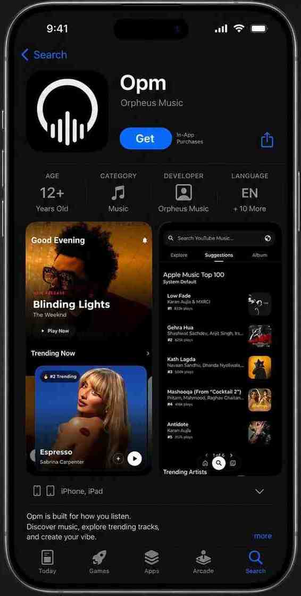
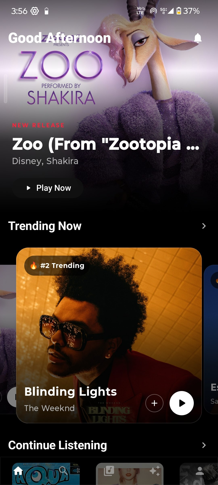
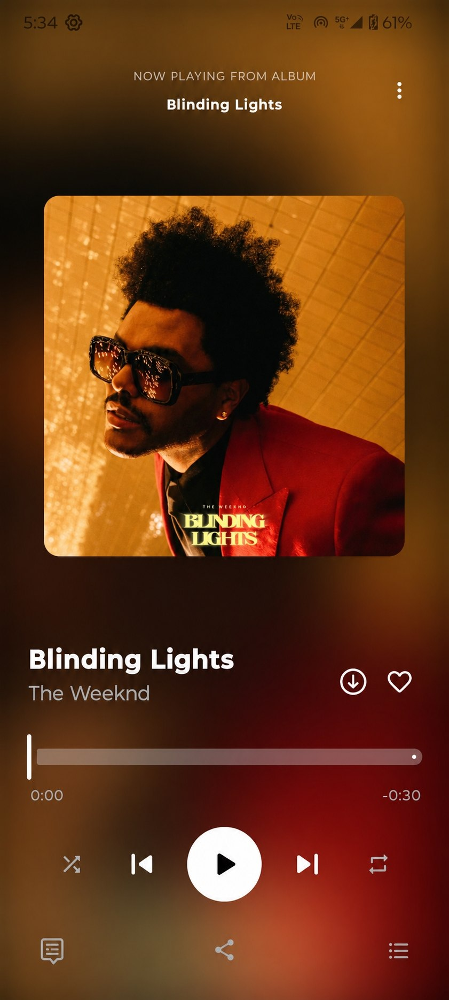
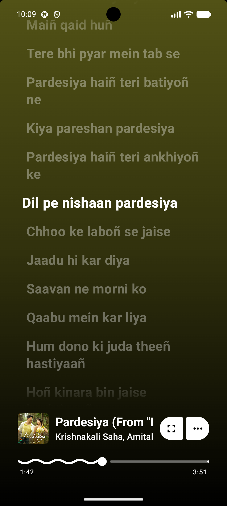
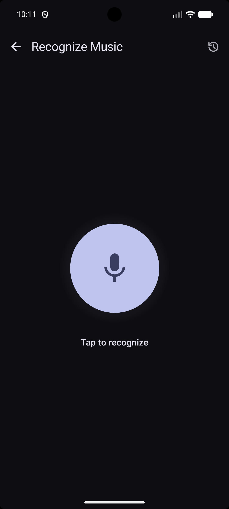

<div align="center">
  

  <h1>OPM</h1>

  <p><strong>A modern open-source Android music player with ad-free streaming, synced lyrics, beautiful UI, offline playback, and a premium listening experience.</strong></p>

  <p align="center">
    <a href="https://github.com/sauravthakurq/opm/releases">
      
    </a>
  </p>
  <p align="center">
    <a href="https://github.com/sauravthakurq/opm/stargazers">
      
    </a>
  </p>
  <p align="center">
    <a href="LICENSE">
      
    </a>
  </p>

  <br>

  <a href="https://github.com/sauravthakurq/opm/releases/latest/download/opm.apk">
    
  </a>
  <p><em>Latest Release • Android 8.0+ • GPL-3.0 • 100% Open Source</em></p>

  <br>

  <p>🎵 Ad-Free &nbsp;•&nbsp; 🔓 Open Source &nbsp;•&nbsp; 🚀 Material You &nbsp;•&nbsp; 📱 Android 8+ &nbsp;•&nbsp; ❤️ GPL-3.0</p>
</div>

---

## Overview

OPM is a premium, open-source Android music player designed for users who want complete control over their music experience. Built with a focus on privacy, aesthetics, and performance, OPM delivers high-quality streaming, immersive real-time lyrics, and total personalization—all without advertisements or hidden fees.

<div align="center">
  

  <br><br>

  <a href="https://github.com/sauravthakurq/opm/releases/latest/download/opm.apk">
    
  </a>

  <p><em>Tap above to download the latest OPM APK.</em></p>
</div>

---

OPM is a premium, open-source Android music player designed for users who want complete control over their music experience. Built with a focus on privacy, aesthetics, and performance, OPM delivers high-quality streaming, immersive real-time lyrics, and total personalization—all without advertisements or hidden fees.

## Table of Contents

- [Why OPM?](#why-opm)
- [Screenshots](#screenshots)
- [Features](#features)
  - [Music](#music)
  - [Lyrics](#lyrics)
  - [Personalization](#personalization)
  - [Performance](#performance)
  - [Open Source](#open-source)
- [Installation](#installation)
- [Privacy](#privacy)
- [Contributing](#contributing)
- [License](#license)
- [Developer](#developer)

---

## Why OPM?

OPM was created to provide a pristine, uninterrupted listening environment. Whether you are caching tracks for offline commutes, admiring perfectly synced word-by-word lyrics, or customizing your player's glow, OPM offers a flagship-tier experience built entirely on absolute trust and transparency.

---

## Screenshots

<div align="center">
  <table style="margin: 0 auto; border-collapse: collapse;">
    <tr>
      <td align="center" style="padding: 10px; border: none;">
        <strong>Home Screen</strong><br><br>
        
      </td>
      <td align="center" style="padding: 10px; border: none;">
        <strong>Music Player</strong><br><br>
        
      </td>
      <td align="center" style="padding: 10px; border: none;">
        <strong>Synchronized Lyrics</strong><br><br>
        
      </td>
    </tr>
    <tr>
      <td align="center" style="padding: 10px; border: none;">
        <strong>Search & Explore</strong><br><br>
        
      </td>
      <td align="center" style="padding: 10px; border: none;">
        <strong>Music Library</strong><br><br>
        
      </td>
      <td align="center" style="padding: 10px; border: none;">
        <strong>OPM Find</strong><br><br>
        
      </td>
    </tr>
  </table>
</div>

---

## Features

### Music
- **Ad-Free Streaming:** Listen to millions of tracks without a single interruption.
- **Background Playback:** Keep the music going with the screen off or while using other apps.
- **Offline Downloads:** Cache your favorite albums and playlists for zero-buffering offline playback.
- **Audio & Video Playback:** Seamlessly switch between audio-only streams and music videos.
- **Queue Management:** Intelligent queues, crossfade transitions, and easy playlist curation.

### Lyrics
- **Synced Lyrics:** Real-time lyric tracking so you never miss a beat.
- **Word-by-Word Lyrics:** Immersive, karaoke-style word highlighting.
- **Multiple Providers:** Reliable lyrics sourced automatically from various high-quality providers.

### Personalization
- **Themes:** Gorgeous Dark and Light modes designed for AMOLED and IPS displays.
- **Material Design:** A highly polished UI respecting modern Android design language.
- **Dynamic Colors:** Interface elements adapt to match the album artwork of your currently playing song.
- **UI Customization:** Adjust player backgrounds, density scales, and layouts to fit your aesthetic.

### Performance
- **Jetpack Compose:** Built with a fully modern UI toolkit for exceptional responsiveness.
- **Smooth Animations:** Fluid transitions, fluid navigation, and micro-interactions throughout the app.
- **Optimized Performance:** Lightweight architecture ensuring minimal battery drain and lightning-fast loading.

### Open Source
- **GPL-3.0:** Truly free and open software.
- **Community Driven:** Evolving continuously based on user feedback and community pull requests.
- **Transparent Development:** No hidden analytics, telemetry, or shady background processes.

---

## Installation

### Download APK
1. Download the latest `opm.apk` from the [Releases Page](https://github.com/sauravthakurq/opm/releases/latest).
2. Tap on the downloaded file to install.
3. If prompted, allow installations from unknown sources in your Android settings.

### Building from Source

To compile the app yourself, follow these standard steps:

```bash
# Clone the repository
git clone https://github.com/sauravthakurq/opm.git

# Enter the project directory
cd opm

# Build the debug variant
./gradlew assembleUniversalGmsDebug
```

---

## Privacy

Your data is yours. OPM is built on absolute privacy and trust:
- **No Tracking:** Zero analytics trackers, zero telemetry, and zero user profiling.
- **No Ads:** Completely ad-free experience, forever.
- **Open Source:** Every line of code is public and auditable by anyone.
- **Privacy First:** We only connect directly to music APIs—no middleman servers.

---

## License

This project is proudly licensed under the [GPL-3.0 License](LICENSE). This guarantees that OPM remains free, open-source software, and any derivative works must also be open and free.

---

## Contributing

We welcome developers, designers, and music lovers to help make OPM even better. Feel free to open issues, submit pull requests, or translate the app. Dive into our source code and join the movement!

---

## Developer

**Saurav Thakur**
- **GitHub:** [sauravthakurq](https://github.com/sauravthakurq)
- **LinkedIn:** [Saurav Thakur](https://linkedin.com/in/sauravthakurq)
- **Email:** [sauravthakur6310@gmail.com](mailto:sauravthakur6310@gmail.com)

---

<div align="center">
  <p>Built with ❤️ for music lovers.</p>
  <p>Designed & Developed by <strong>Saurav Thakur</strong></p>
  <p>Licensed under GPL-3.0</p>
</div>
